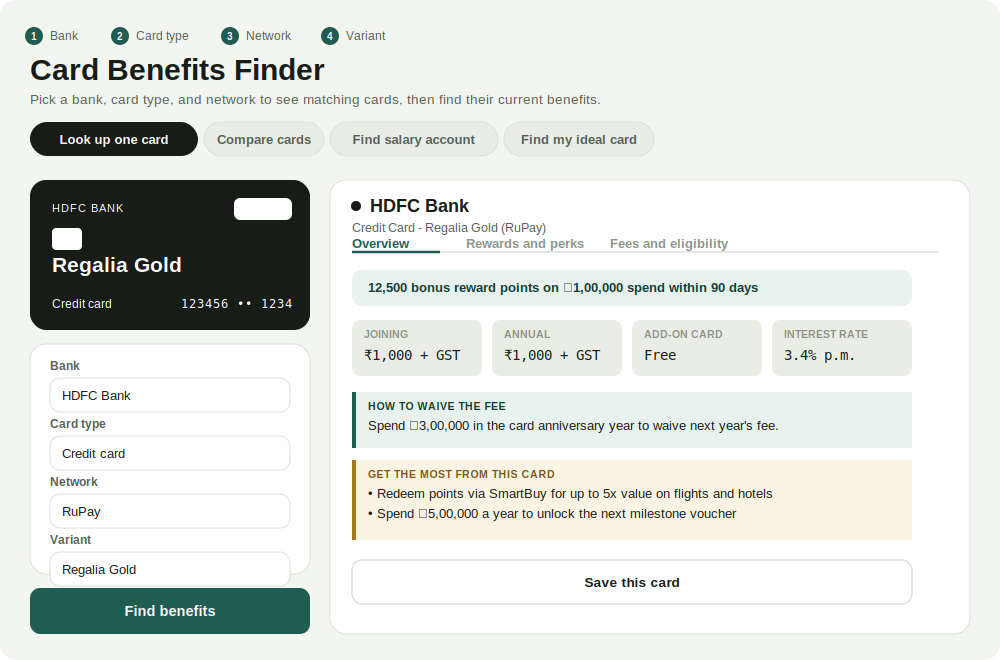
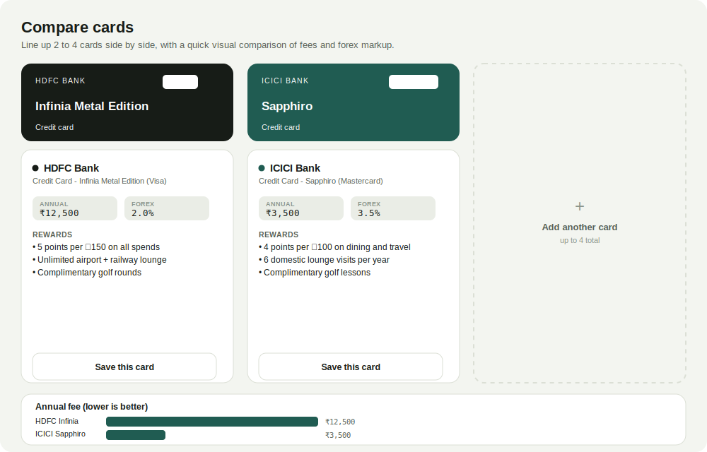

# FinMitra — your financial friend

A one-stop tool for figuring out what your Indian bank cards, salary account, and deposits actually give you — without visiting a dozen different bank websites to find out.

Pick your bank, card type, and network, and it pulls current fees, rewards, lounge access, insurance, and forex markup straight from a live search — not a static database that goes stale the moment a bank changes its terms. It also compares salary accounts, recommends cards based on your spending habits, and compares FD/RD interest rates across banks.

## What it looks like

*(These are illustrative mockups built from the app's actual design, not live screenshots — this project doesn't include screenshot tooling. Note: these mockups predate the multi-page rebuild, so the navigation shown as tabs is now a proper top nav bar across separate pages — the individual tool screens themselves still look like this.)*

**Looking up a single card:**

**Comparing multiple cards side by side, with the fee/forex chart:**

## Why this exists

Every Indian bank publishes its card benefits differently, buries the fine print in different places, and updates offers without much notice. If you've ever tried to answer "does my card actually waive its annual fee if I spend enough" or "which of these three cards has better lounge access," you've probably opened five tabs and given up halfway through. This tool exists to answer that in one place, in under a minute.

## What you can do here

**Look up one card**
Four dropdowns — bank, card type, network, variant — and you get a full breakdown: fees, how to waive them, rewards, lounge access, insurance, forex markup, milestone perks, and concrete tips on getting the most value out of that specific card.

**Compare 2 to 4 cards side by side**
Line up multiple cards at once, with a visual chart comparing annual fees and forex markup at a glance, plus a button to download or copy the full comparison.

**Find the right salary account**
Tell it your monthly salary range and it recommends accounts you'd actually qualify for, ranked by real value — zero balance requirements, sweep-in FDs, debit card tier — not just the first result a bank's marketing page pushes.

**Find my ideal card**
Answer a few questions about where you spend the most, how much, and whether lounge access matters to you, and it recommends cards that fit your actual habits instead of requiring you to already know what to search for.

**Ask anything**
A chat box for specific questions like "which card gives free Coursera access" or "which card has the lowest forex markup" — it searches live rather than answering from memory, and says so plainly when it can't confirm something rather than guessing.

**Save cards and track fee waivers**
Bookmark cards you're considering, and if a card's fee waiver depends on hitting a spend threshold, track your progress toward it right in the app.

## How to use it

FinMitra is a proper multi-page site now — a home page with a tool grid, and one dedicated page per tool, linked from the navigation bar on every page. Pick a tool below to jump straight in:

- **Look up a card** — pick a bank, card type, network, and variant (long lists are searchable, just start typing), and get fees, rewards, lounge access, and how to waive the annual fee, split into Overview / Rewards / Fees and eligibility tabs so you're not scrolling through everything at once.
- **Compare cards** — line up 2 to 4 cards side by side with a visual fee/forex chart.
- **Find a salary account** — enter your monthly salary range for accounts you'd actually qualify for.
- **Find my ideal card** — answer a few quick questions about your spending instead of already knowing what to search for.
- **Compare investments** — FD/RD rate comparisons and mutual fund risk guidance.
- **Optimize my cards** — tell it what you already hold, get a plan for using each one to full potential.
- **Saved cards** — everything you've bookmarked, plus links to each network's own benefits portal.
- **Ask a question** — a chat button in the bottom corner is available on every page for anything not covered above.

## How accurate is this, really

Worth being direct about this rather than letting it be a surprise:

- **Every result comes from a live search at the moment you ask**, not a stored database. That's the whole point — it stays current — but it also means results depend on what's publicly documented on the web right now. A benefit that's only mentioned in an in-app notification or a physical welcome kit won't show up here.
- **Source links may occasionally stop working.** They route through Google's search infrastructure, which doesn't guarantee link permanence. Every source comes with a backup search link specifically so a dead link never leaves you stuck.
- **Network availability in the dropdowns is a best-effort list**, not verified live against every bank's current catalog. If a variant you know exists isn't showing up under a particular network, it's still searchable by typing it directly.
- **Nothing here is financial advice.** Treat every result as a strong starting point for your own decision, and confirm fees, interest rates, and eligibility on the bank's own page before applying for anything.

## Frequently asked questions

**Is this affiliated with any bank?**
No. This is an independent tool that searches publicly available information. It has no relationship with HDFC, ICICI, SBI, or any other bank or card network mentioned.

**Do I need to enter my real card number?**
Never for looking up benefits. The optional "BIN" field (just the first 6-8 digits, not a full card number) exists only to make it faster to visit each network's own public offers portal (Visa, Mastercard, RuPay Select, etc.) — those portals require it themselves. The app never asks for a full card number, expiry, or CVV, and nothing you enter is sent anywhere beyond your own browser's local storage.

**Is my data safe?**
Saved cards, BINs, and spend-tracking figures are stored only in your browser's local storage on your own device. They're never uploaded to a server or shared with anyone.

**Why does it sometimes say "I couldn't confirm this"?**
Because that's the honest answer when a search doesn't turn up a clear result. The alternative — guessing — is worse than not answering, especially for something like a fee amount or eligibility rule.

## Running your own copy

This is open source. If you want to self-host it — you'll need your own free Gemini API key — see [DEPLOYMENT.md](DEPLOYMENT.md) for setup, Docker, and hosting instructions (Render, a VPS, or AWS S3 + Lambda).

## License

See [LICENSE](LICENSE).

## Disclaimer

This tool is provided for informational purposes only and does not constitute financial advice. Card benefits, fees, and eligibility criteria change frequently and are set entirely by the issuing banks and card networks — always verify details on the official bank page before making any financial decision.
